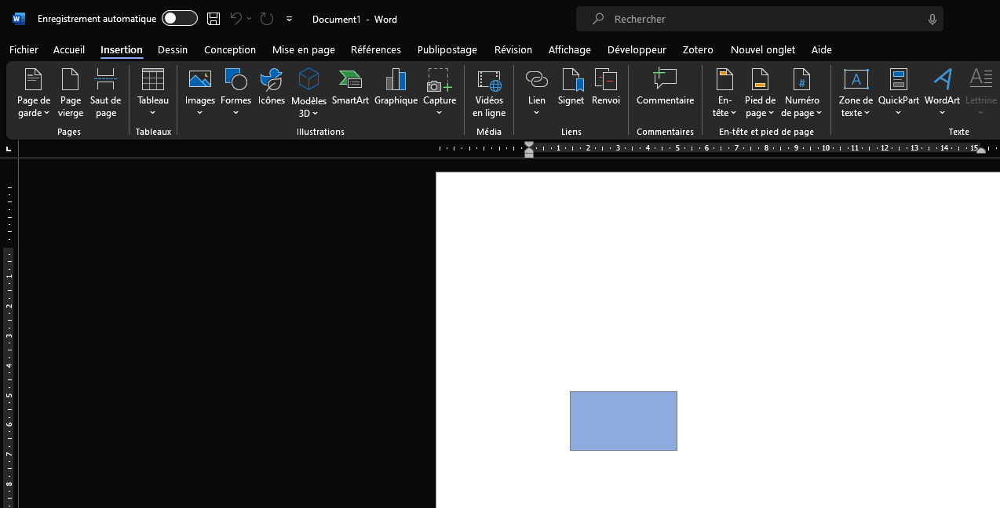

**Mise à jour: 12 février 2024**

**Fait par: Marie-Christine Marquis**

Durée: **7 minutes**

## **Introduction:**

Dans ce tutoriel, vous serez en mesure de **créer un rectangle** sur une page dans le logiciel **Word**. 
Prendre note que ce tutoriel à été fait avec **Microsoft 365 Apps pour entreprise** (**Word**) en mode 
sombre. De plus, pour la présentation, un nouveau fichier vierge a été créé et sera le point de départ 
de la démonstration.

## **Procédure:**

**1.** Allez dans le menu principal du logiciel et cherchez le mot **Insertion** et 
	**sélectionnez-le** à l'aide de votre souris. Une **ligne bleu va apparaitre 
	en dessous du mot Insertion**.

	

**2.** Allez ensuite en dessous de l'onglet **Insertion**. À partir de la gauche sur la
	troisième section nommée **Illustrations**, Trouvez le mot **Formes** et
	**sélectionnez-le**.

	

**3.** Un nouveau menu vous apparait. **Cliquez sur le bouton rectangle** de ce menu. Il est situé
	dans la première section du haut, sur la première ligne.

	

**4.** À l'aide de la souris, **placez votre pointeur à l'endroit ou vous voulez commencer 
	votre rectangle** sur votre page, puis **confirmer** le point en utilisant le clique de 
	sélection et **maintenir le bouton**. 

		 

**5.** Toujours à l'aide de votre souris et en maintenant toujours votre bouton, **dirigez 
	votre pointeur vers le point final de votre rectangle**. 

	
 
		

			**_Note_**
		
 
		Le point de commencement d'un rectangle est toujours au coin haut gauche et
		le point final est toujours le point bas à droite.
	

	
		

**6.** Lorsque vous êtes satisfait de votre rectangle, vous pouvez **relâcher le bouton** de
	votre souris.

		

Et voilà, votre rectangle est créé. 

 
		

			**_Notes_**
		
 
		Vous pouvez ajouter plus d'un rectangle sur la page si vous le désirez en 
		répétant les étapes ci-dessus. 
		
		De plus, vous pouvez le modifier et le changer de couleur. 

		Pour plus d'information, je vous invite à utiliser le lien suivant pour changer 
		de couleurs: 

		https://support.microsoft.com/fr-fr/office/changer-les-couleurs-d-une-zone-de-texte-ou-d-une-forme-c3ab6bb7-89f9-4908-912e-e86ea5fd106d.

		Et pour modifier:
		
		https://support.microsoft.com/fr-fr/office/op%C3%A9rations-de-base-sur-les-formes-redimensionner-mettre-en-forme-d%C3%A9placer-et-ajouter-du-texte-%C3%A0-des-formes-56f7ca25-9490-4487-a4e5-15ca4e6bbe50

	
